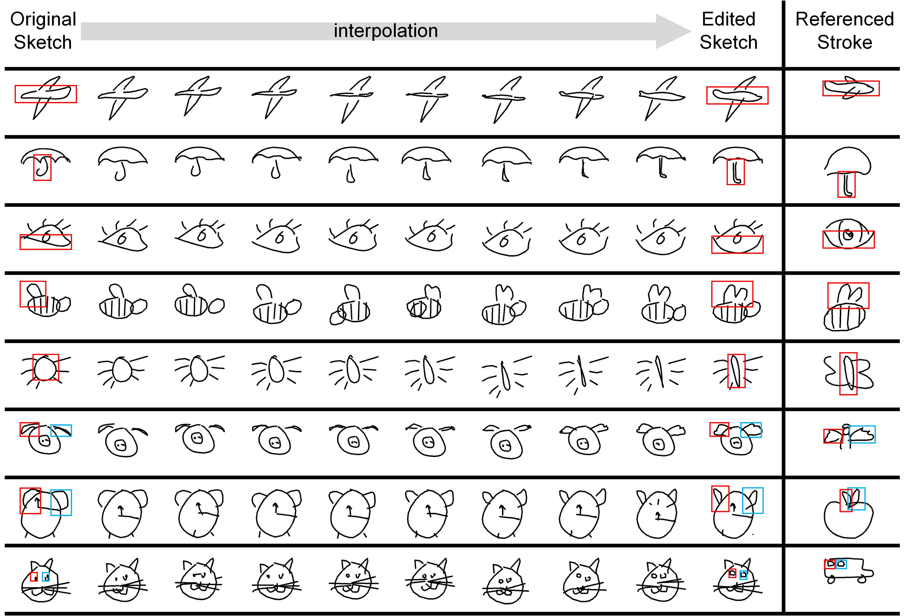
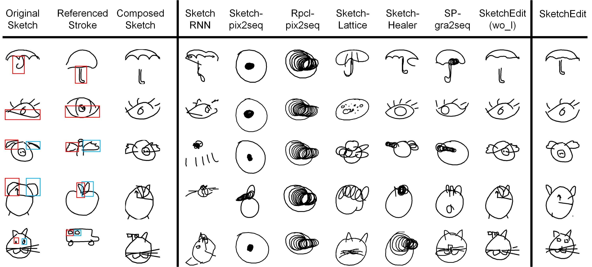
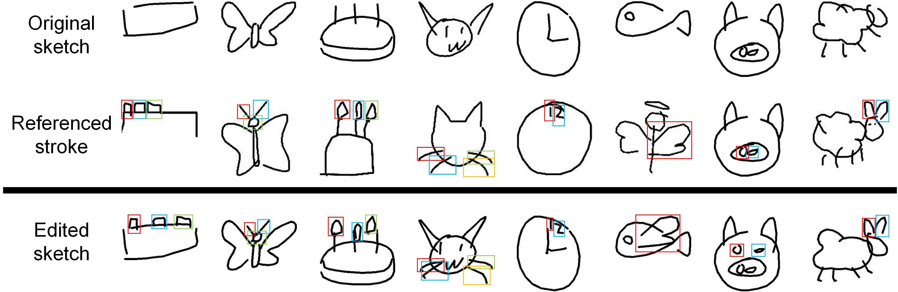

# SketchEdit: Editing Freehand Sketches at the Stroke-level
This is the official implementation of the paper "SketchEdit: Editing Freehand Sketches at the Stroke-level", which was accepted for IJCAI-2024.
You can edit freehand sketches by picking any strokes and modifying them to generate creative sketches without having to think about determining the position of the strokes.


# Installation
```
git clone https://github.com/CMACH508/SketchEdit/
cd SketchEdit
pip install -r requirements.txt
```
# Preparing Dataset
Download data from the [QuickDraw dataset](https://quickdraw.withgoogle.com/data) for the corresponding categories and storage these data to the './dataset/' fold.

# Training
```
# The pretrained model of 17-category are provided in the './model_save/' fold. You can train your own dataset as follows.
# Encoder and Decoder. We recommend using more categories.
python -u Train.py
# Noise predicetor U-Net.
python -u Diffusion_Train.py
```

# Evaluation
```
# Visualize the groudtruth sketches to './GroundTruth/' fold.
python -u DrawAll.py
# Reconstruct sketches with original stroke locations.
python -u Inference.py
# Reconstruct sketches with generated stroke locations.
python -u Diffusion_Inference.py


# Calculate metrics.
cd evaluations
python CLIP_score.py ../results/ ../GroundTruth/ --real_flag img --fake_flag img --device cuda
python fid_score.py ../results/ ../GroundTruth/ --gpu 0
python lpips_score.py --path1 ../results/ --path2 ../GroundTruth/
python CLIP_score.py ../diffusion_results/ ../GroundTruth/ --real_flag img --fake_flag img --device cuda
python fid_score.py ../diffusion_results/ ../GroundTruth/ --gpu 0
python lpips_score.py --path1 ../diffusion_results/ --path2 ../GroundTruth/
```

# Inference
```
# Record the strokes and their embeddings to './stroke/' fold.
python -u Dataset.py
python -u save_embedding.py

# Replace strokes, inteplorate between strokes, and add strokes.
# First, select the to be edited sketch and referenced sketch from the './GroundTruth/' fold and record their id, e.g. 7886 (the 386th sketches in the test set of 'angel') and 8196.
# Second, according to the shape of strokes, select the corresponding id of to be edited strokes and referenced strokes from the './stroke/' fold.
# Third, record the selected strokes' id, e.g. the 3rd stroke of 7886 and the 4th stroke of 8196. If you want to add a stroke, trying to select the first padding stroke as to be edited stroke, e.g. 5th stroke of 7886.
# Finally, modify the parameters in "Replace.py" and run the code. You will find the creative sketches in './sample_tmp/' fold.

python -u Replace.py

The parameters in "Replace.py" are followings:
    sketch_idx = 7886  # to be edited sketch
    sketch_stroke_idx = [3] # to be edited strokes
    template_idx =8196 # referenced sketch
    template_stroke_idx = [4] # referenced strokes from referenced sketch
```

# Hyperparameters
```
class HParams:
    def __init__(self):
        self.data_location = './dataset/'#location of  of origin data
        self.category = ["airplane.npz", "angel.npz", "alarm clock.npz", "apple.npz",
                         "butterfly.npz", "belt.npz", "bus.npz",
                         "cake.npz", "cat.npz", "clock.npz", "eye.npz", "fish.npz",
                         "pig.npz", "sheep.npz", "spider.npz", "The Great Wall of China.npz",
                         "umbrella.npz"]
        self.model_save = "./model_save"
        if not os.path.exists(self.model_save):
            os.mkdir(self.model_save)
        self.gpus=[0, 1,2,3, 4] #id of gpus

        self.k = 40 # Components  of GMM
        self.M = 20 # parameters of MDN

        self.stroke_num = 25 # strokes length
        self.stroke_length = 96 # points in a stroke

        self.d_model = 128 # d_model in decoder
        self.d_ffn = self.d_model*4

        self.ud_model = 96 # d_model in unet
        self.ud_ffn = self.ud_model*4


        self.dropath = 0.1
        self.batch_size = 200 # batch size of first stage training
        self.ubatch_size = 768 # batch size of second stage training

        self.warmup_step = 1000
        self.epochs = 15 # epochs of first stage training
        self.uepochs = 40 # epochs of second stage training

        self.eta_min = 0.01
        self.wKL = 0.0001
        self.lr = 0.002 # learning rate of first stage training
        self.ulr = 5e-4 # learning rate of second stage training

        self.beta0 = 1e-4 # beta_0 of the diffusion scheduler
        self.betaT = 0.02 # beta_T of the diffusion scheduler

        self.min_lr = 0.00001
        self.temperature = 0.001

        self.ddim_step = 60 # 10 is ok

        self.max_seq_length = 180 # points length
        self.min_seq_length = 0
```
# Stroke Interpolation

 

# Stroke Replacement



# Adding Strokes



# Citation
If you find this work useful for your research, please cite our paper:
```
@inproceedings{ijcai2024p493,
  title     = {SketchEdit: Editing Freehand Sketches at the Stroke-Level},
  author    = {Li, Tengjie and Tu, Shikui and Xu, Lei},
  booktitle = {Proceedings of the Thirty-Third International Joint Conference on
               Artificial Intelligence, {IJCAI-24}},
  publisher = {International Joint Conferences on Artificial Intelligence Organization},
  editor    = {Kate Larson},
  pages     = {4461--4469},
  year      = {2024},
  month     = {8},
  note      = {Main Track},
  doi       = {10.24963/ijcai.2024/493},
  url       = {https://doi.org/10.24963/ijcai.2024/493},
}
```

